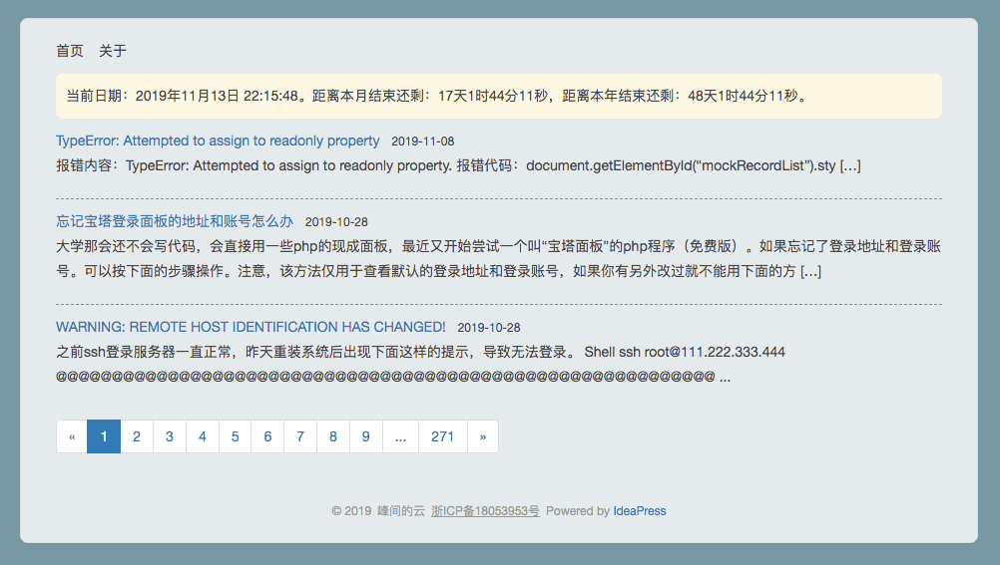
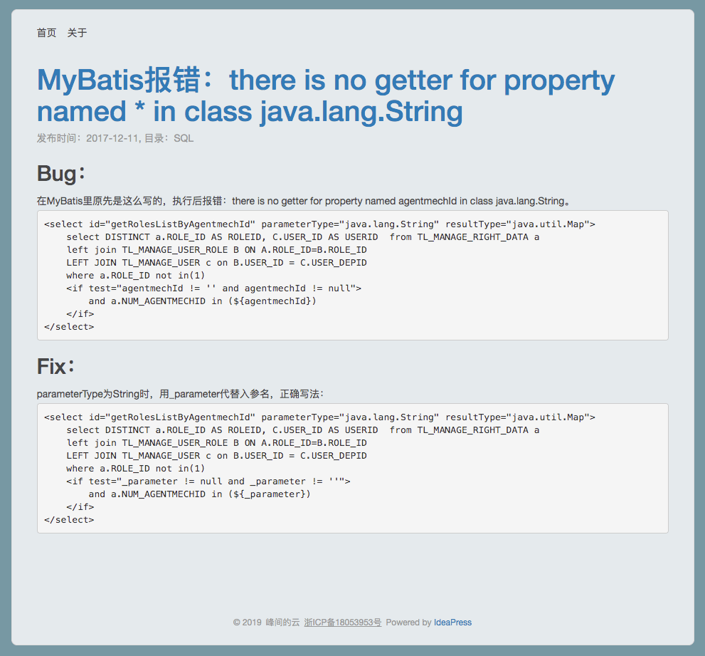

# IdeaPress

NodeJS构建的内容发布系统（前台部分），使用next.js9+，为同构项目，同时支持服务端渲染（SSR）和客户端渲染。

## 项目介绍

由于前台项目面向大众用户，考虑到兼容性，前台系统不使用Ant-Design（兼容到IE9）、Material-UI（兼容到IE11）这类UI库，而是使用Bootstrap3（兼容到IE8）。

本项目不建议完整纳入整个后台接口服务，这里出于示例需要，展示了两种获取数据的方式：

- 通过***请求转发***查询（推荐的方式，参考本项目中查询文章详情数据的部分）。
- node直连mysql查询文章详情（不建议的方式，参考本项目中查询文章列表数据的方式）。

## 项目截图

文章首页/列表页（为了显示完整信息，特意将页面显示文章数量调整为3篇）：




文章详情页（选了一篇短的）：



## 兼容性

兼容到IE8。

## 为何不带中台系统

这里所谓的中台系统，指的是用于管理IdeaPress内容的管理系统这样的系统。

因为中台服务的服务端部分打算用Java写，前端部分打算采用纯前端单页应用的形式（react）。

## 常用命令

```bash
# 安装依赖
npm i

# 开发
npm run dev

# 本地构建
npm run devProduction
```

## 项目部署

***建议使用`pm2`进行项目的启动与维护。***

1、全局安装pm2依赖

```bash
npm i -g pm2
```

2、启动项目

在项目根目录下执行：

```bash
# 初次启动
npm run start

# 重启
npm run restart
```

3、开启自启动

执行下述命令，pm2会给出一串脚本命令，在终端中复制粘贴该命令并回车执行即可。

```bash
npm run getShellUsedToStartProjectAfterReboot
```

4、查看项目日志

```bash
npm run log
```

5、停止和删除项目

停止项目：

```bash
npm run stop
```

从PM2项目清单中删除项目：

```bash
npm run delete
```

## License

MIT协议。免费开源，可以随意使用，但因使用而产生的问题请自行负责。
