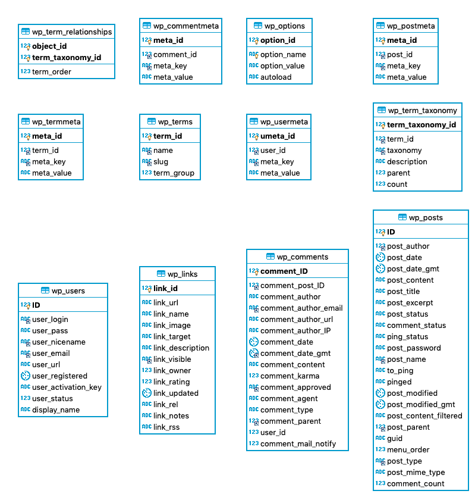

# IdeaPress

NodeJS构建的博客，使用next.js9+，为同构项目，同时支持服务端渲染（SSR）和客户端渲染。

## 兼容性

前端：兼容到IE8。

## 服务端环境

node: >=10.13.0

## 项目表结构

本项目用的是WordPress程序生成的数据库。不涉及视图、存储过程，涉及12张表：

- wp_commentmeta
- wp_comments
- wp_links
- wp_options
- wp_postmeta
- wp_posts
- wp_term_relationships
- wp_term_taxonomy
- wp_termmeta
- wp_terms
- wp_usermeta
- wp_users

相关ER图（实体关系图，entity-relationship diagram）如下：



## 常用命令

```bash
# 安装依赖
npm i

# 开发
npm run dev

# 本地构建
npm run devProduction
```

## 项目部署

***建议使用`pm2`进行项目的启动与维护。***

1、全局安装pm2依赖

```bash
npm i -g pm2
```

2、启动项目

在项目根目录下执行：

```bash
# 初次启动
npm run start

# 重启
npm run restart
```

3、开启自启动

执行下述命令，pm2会给出一串脚本命令，在终端中复制粘贴该命令并回车执行即可。

```bash
npm run getShellUsedToStartProjectAfterReboot
```

4、查看项目日志

```bash
npm run log
```

5、停止和删除项目

停止项目：

```bash
npm run stop
```

从PM2项目清单中删除项目：

```bash
npm run delete
```

## License

MIT协议。免费开源，可以随意使用，但因使用而产生的问题请自行负责。
